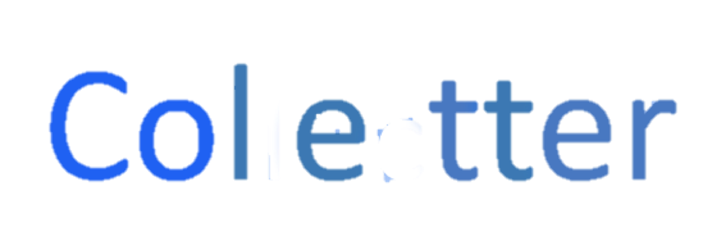

## About Team
Colleector is the project made by team JDR-TM during the 2018 Mei-chu Hackathon.  
  
We are students from NCU, friends from student ambassador.

- Jimmy from department of MIS.
- David from department of ME.
- Ruyi from department of EE.
- Tony from department of DOP.
- Morris from department of DOE.

## Background
Collecter is a map based web application, we found that in the information age, people like to share things with other people in the internet community.  We are kind of more talktive toward annoymous person through internet. Internet made up a community and we are "Netizens".

## About Collector

More and more people chat online with annoymous people. We want to catch up with the trend and to combine it with scenic spots. Paper post card are less attractive to vistors in nowdays, smart phone substitudes the post cards and paper photos.

Collector let users send postcard online to annoymous person, there is only one reciever that will recieve the card. What would you write to the people you don't know? You only have one chance to write to the person and won't even get a reply.  Isn't this interesting?

## License

The Laravel framework is open-source software licensed under the [MIT license](https://opensource.org/licenses/MIT).
